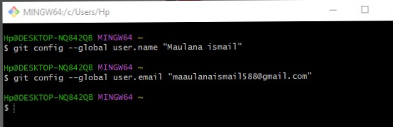

# Tutorial cara penggunaan git

Pertama kalian harus instal terlebih dahulu software Git Lalu kalian bisa buka software tersebut

1.Login Git
Langkah pertama kalian adalah memasukan username dengan menggunakan perintah

$ git config --global user.name "UsernameAnda"

lalu kalian tambahkan juga email dengan menggunakan perintah

$ git config --global user.email "email anda"

2.Login Github

Langkah kedua kalian bisa login ke dalam website github, Setelah kalian login akan muncul tampilan dashboard dari github tersebut

3.Buat Repository

Setelah berhasil login ke GitHub, Anda bisa mulai membuat repository. Klik tombol New pada menu Repositories untuk membuat repository baru.

4.Buat Folder

Lalu kalian buat folder di localdisk koomputer kalian

5.jika sudah kalian klik kanan pada folder tersebut lalu klik Git Bash

7.Buat folder dengan menggunakan perintah dan buka folder tersebut

$mkdir latihan1

$cd latihan

.png)

8.dan tambahkan file README.md dengan menggunakan perintah

$echo "#LatihanVCS" >> README.md

image

9.kemudian buat repository lokal menggunakan perintah

$git init

image

10.Untuk menambahkan file yang baru saja dibuat tersebut menggunakan perintah

$git add README.md

image

11.Untuk menambahkan file yang baru saja dibuat tersebut gunakan perintah

$git add README.md

image

12.Untuk menyimpan perubahan yang ada kedalam database repository local, gunakan perintah

$git commit -m "first commit"

image

13.kemudian gunakan perintah

$git branch -M main

image

14.Setelah itu menambahkan remote repository. remote Repository merupakan repository server yang akan digunakan untuk menyimpan setiap perubahan pada local repository, sehingga dapat diakses oleh banyak user. dengan menggunakan perintah

$git remote add origin https://github.com/Lans210504/VCS1.git

image

15.Dan untuk mengirim perubahan pada local repository ke server gunakan perintah

$git push -u origin main

Dan kita bisa cek di repository langsung pada website github image

